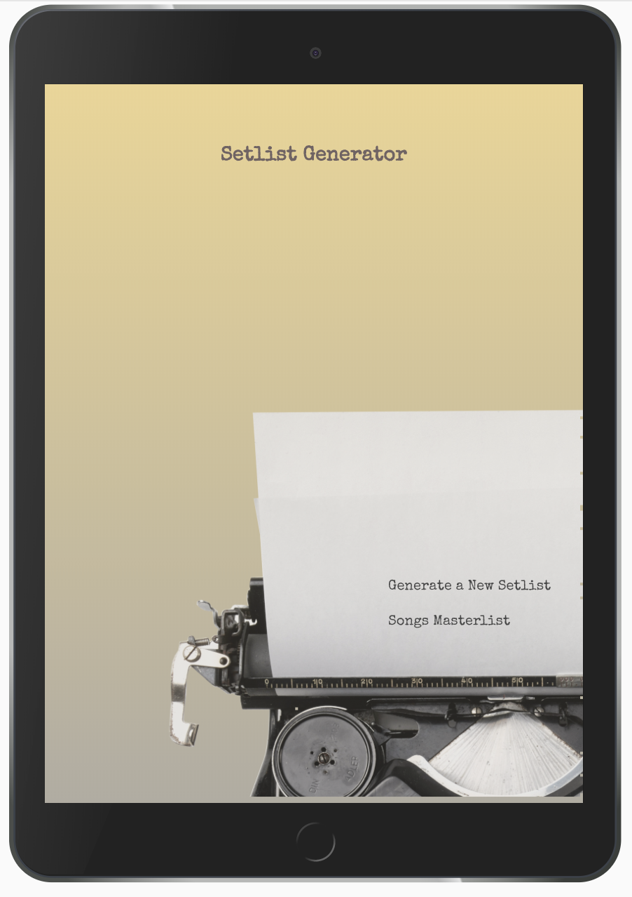
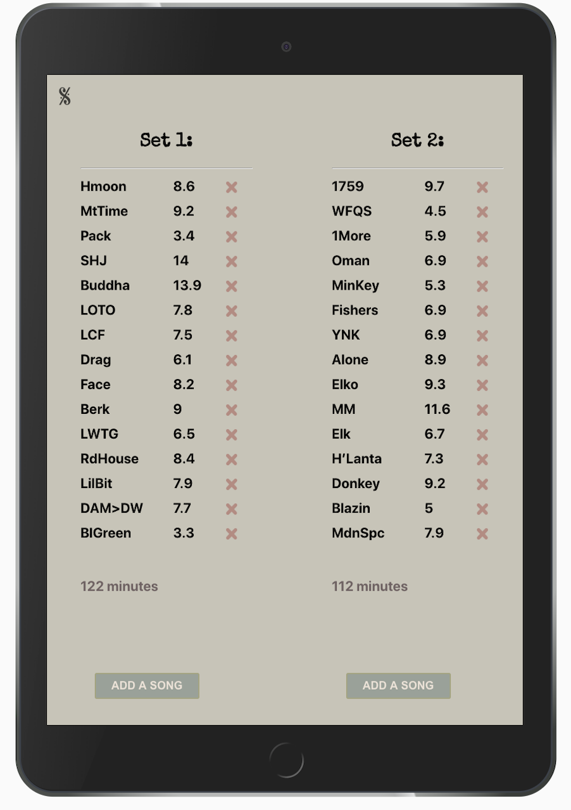
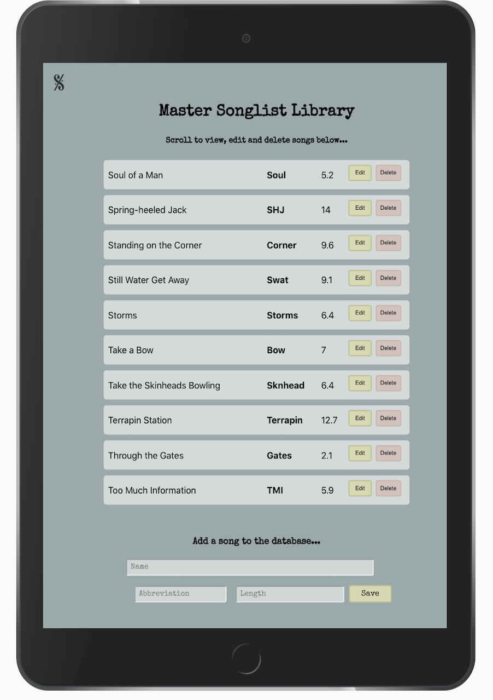

# Setlist Generator

[http://setlist-generator.surge.sh/] (http://setlist-generator.surge.sh/)

Setlist Generator is an app designed to simplify the touring musician's tedious chore of producing unique, nightly setlists by randomly generating a list of songs for from a hardcoded, editable masterlist database.  The Setlist Generator will produce a random list and allow the user to eliminate the suggestions that don't work for that set for any reason ranging from musican's personal preference to the demands of a particular geographical location.  

<!-- 
A user will be able to generate a random list, rearrange it and archive the final version to a database, to help avoid song overlap at the same venue in a short period of time as well as excessive overlap of the same songs on consecutive nights in the same tour run.   -->

Setlist Generator is designed with tablet-first view, as it is a tool to be used at a table optimially in a venue's green room or on a tour bus before a show and not necessarily on the go, since mobile screens do not provide adequate space to view and edit full setlists and desktop views are often impractical for touring musicians.  Mobile and desktop views exist but the app will has been optimized for tablet. 

In its current state the Setlist Generator is set up with a custom database for one specific musical group.  It generates lists that display abbreviations of the songs, rather than the entire name of the song (both are listed in the database) because are those are the working titles of such songs for list making and printing purposes, as lists would be printed and distributed to bandmembers and  periodic guest musicians as well as light and sound technicians.

### Set Up
* Fork and clone this repo
* cd into the app directory and run the code in your server
* run rails s to initialize the backend server
* cd into the client directory
* run `npm i`
* run `npm start` and allow the client server to run on an available port

Created with [React](https://reactjs.org/), [Ruby on Rails](https://rubyonrails.org/), and [PostgreSQL](https://www.postgresql.org/)

### Features
* Users can randomly generate two lists of 15 songs, based on the average of two   sets played a night.
* Users can delete songs from the list and fetch new ones
* Full CRUD on the master list of songs, the user can add new songs to the data base, edit and erase them at will.

### Functionality to be added 
* User can save setlists to an archive for later reference.
* User can rearrange the order of the songlist.

 
 
 

