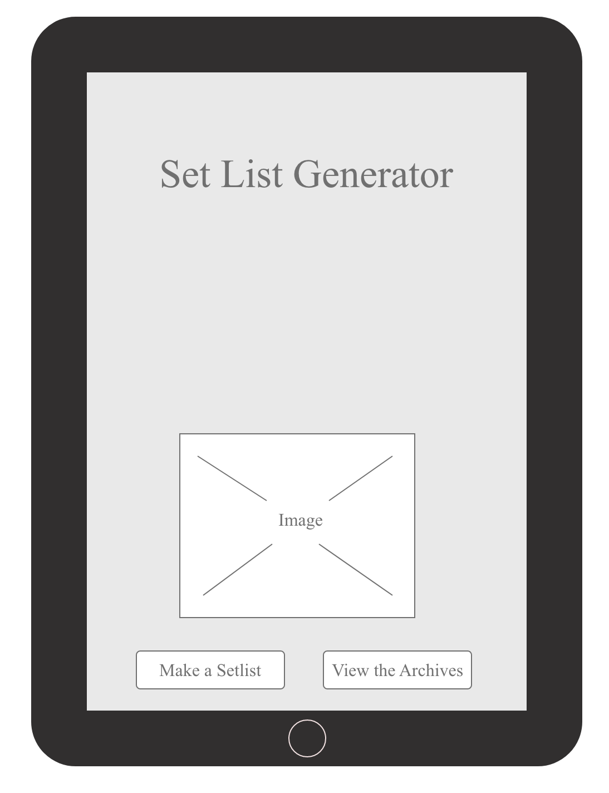
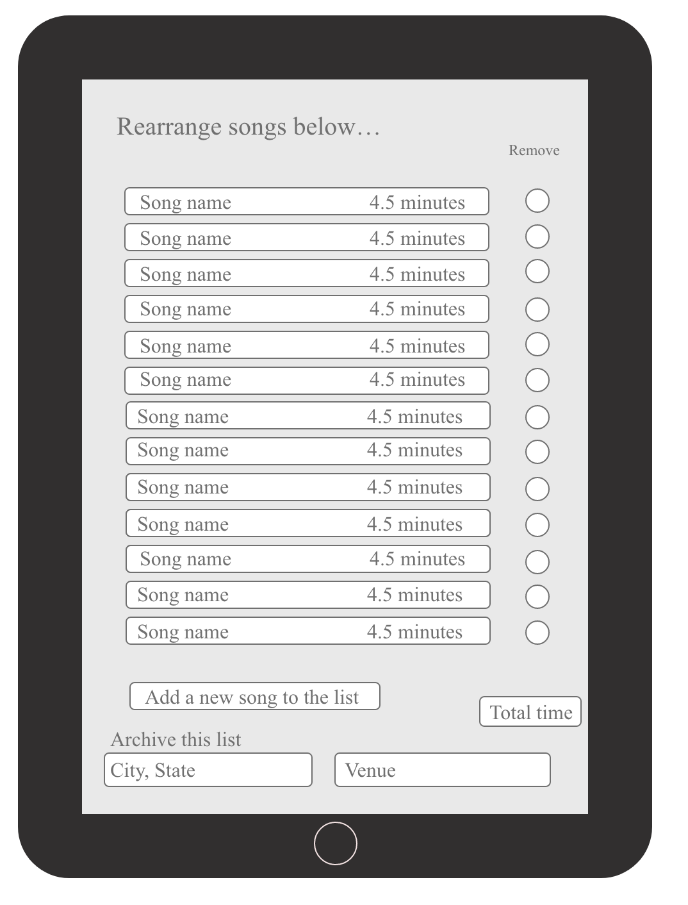
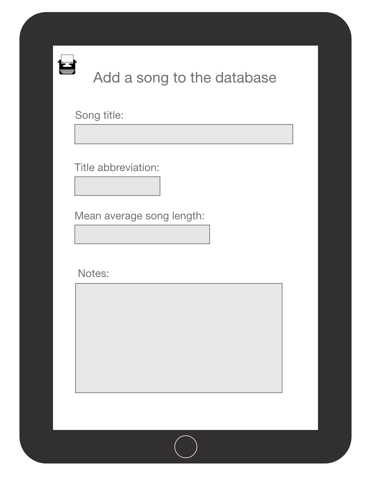
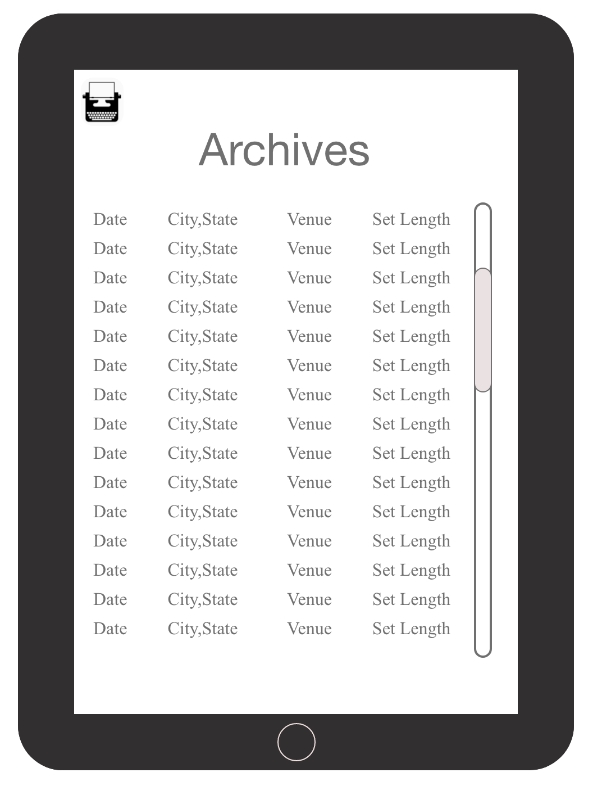

# Setlist Generator

Setlist Generator is an app designed to simplify a touring musician or musical groups's tedious chore of producing unique, nightly setlists by randomly generating a list of songs for from masterlist database.  The Setlist Generator will produce a random list and allow the user to rearrange songs and eliminate the suggestions that don't work for that set for any reason ranging from musican's personal preference to the demands of a particular geographical location.  A user will be able to generate a random list,rearrange it and archive the final version to a database, to help avoid song overlap at the same venue in a short period of time as well as excessive overlap of the same songs on consecutive nights in the same tour run.  

Setlist Generator is designed with tablet-first view as it is a tool to be used at a table optimially in a venue's green room or on a tour bus before a show and not necessarily on the go, since mobile screens do not provide adequate space to view and edit full setlists and desktop views are often impractical for touring musicians.  Mobile and desktop views will exist but the app will be optimized for tablet. 

### Set Up
* Fork and clone this repo
* cd into the app directory and run the code in your server
* run rails s to initialize the backend server
* cd into the client directory
* run `npm i`
* run `npm start` and allow the client server to run on an available port

Created with [React](https://reactjs.org/), [Ruby on Rails](https://rubyonrails.org/), and [PostgreSQL](https://www.postgresql.org/)

### MVP
* Users can randomly generate a setlist based on the time span of their choice.
* Users can rearrange the order of the songlist, delete songs from the list and fetch new ones
* Full CRUD on the master list of songs, the user can add new songs to the data base, edit and erase them at will.
* User can save setlists to an archive for later reference

### PostMVP
* Users can log in
* User can redorder songs with react drag-n-drop
* User can choose a particular song from the database to add to the setlist
* User can make multiple sets on one screen
* User can export a list to emails
* Registered users can add a username, edit and delete their account

## ERD

## Wire Frames

 
 
 
 

# Time line
Day 1 (Monday)      Get the back end running with a hardcoded list of songs
Day 2 (Tuesday)     Start front end, CRUD on songs and get random lists generating
Day 3 (Wednesday)   React DnD, major styling/responsiveness & saving generated setlists to a database
Day 4 (Thursday)    Auth, more styling, email out lists
